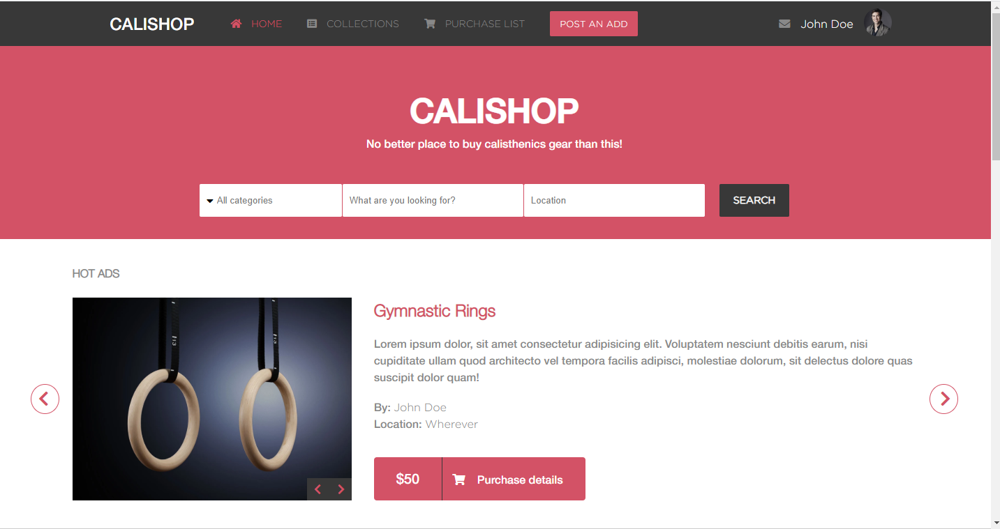
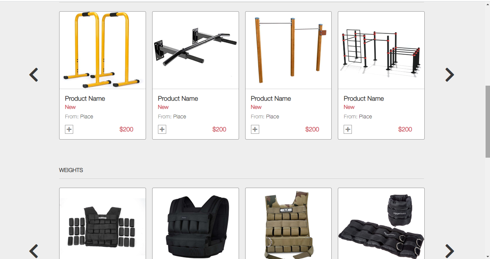
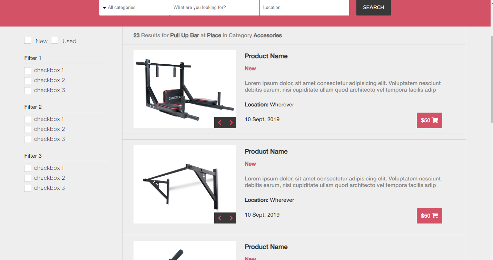

# Cali-shop
This is the Captstone Project for the Microverse CSS and HTML curriculum. The objective of this project is to create a website using the design provided [here](https://www.behance.net/gallery/24796463/ZATTIX) with whatever content you desire. I chose to make a shop for calisthenics gear for fitness enthusiasts.

## Screenshots

## Video Presentation
[Here](https://www.loom.com/share/d79b425a6d2c45fd8606fcf307f66e14) I show the pages comprised in the project, how to acces them and the responsiveness of each one.

## Live Demo
[View the website here](https://rawcdn.githack.com/Blasco9/Cali-shop/f889a3d60102f87b0480e576fe7d5cb1b169618d/index.html)

## Built with
- HTML5
- CSS3
- Flexbox
- Grid

## Credits
All credits for the design goes to [Mohammed Awad](https://www.behance.net/M_Awad)
